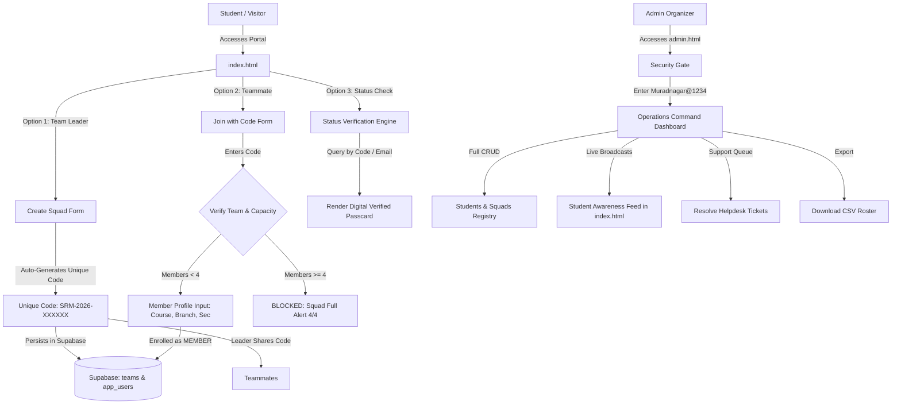

# ⚡ SRM HACKATHON 2026: Official Portal & Operations Command

[](http://localhost:8080/index.html)
[](https://supabase.com)
[](http://localhost:8080/index.html)
[](http://localhost:8080/index.html)

A developer-grade, fully responsive, and password-protected web platform engineered for **SRM Hackathon 2026**. Designed with the **Terminal-Zero / Hacker-Elite** aesthetic, the platform features real-time Supabase database integration, automated unique student verification codes, strict squad capacity enforcement, a live student awareness announcement broadcast system, and a password-protected administrative CRUD operations dashboard.

---

## 📌 Quick Access & Credentials

| Resource | URL / Details |
| :--- | :--- |
| **Public Student Portal** | [http://localhost:8080/index.html](http://localhost:8080/index.html) |
| **Operations Command Admin** | [http://localhost:8080/admin.html](http://localhost:8080/admin.html) |
| **Admin Password** | `Muradnagar@1234` |
| **Supabase Project ID** | `xdgsuebdlmgtfuxtmotv` |
| **Supabase REST API** | `https://xdgsuebdlmgtfuxtmotv.supabase.co/rest/v1/` |

---

## 🏛️ Architectural Workflow



---

## 🚀 Detailed Feature Breakdown

### 1. Main Student Portal (`index.html`)

#### A. Cyber Glitch Hero & Live Countdown
- **Live Countdown Timer**: Real-time JavaScript clock counting down days, hours, minutes, and seconds to the hackathon kickoff.
- **Key Metrics Telemetry**: Quick stat cards showcasing ₹40,00,000+ Prize Bounty, 5 Core Tracks, 36-Hour Non-Stop Sprint, and 150+ Participating Squads.
- **Quick Action Triggers**: Instant anchor routing to Create Squad, Join with Code, and Status Query.

#### B. Challenge Tracks Arena
Five specialized challenge domains with one-click selection buttons that pre-populate the registration form:
1. **AI / MACHINE LEARNING**: Intelligent systems, predictive models, generative AI, NLP, AI agents, and machine learning solutions.
2. **DATA SCIENCE**: Analytics, big data, statistical modeling, visualization, and intelligent decision-making.
3. **DEVOPS & CLOUD**: CI/CD pipelines, Docker, Kubernetes, cloud infrastructure, and monitoring.
4. **COMPUTER VISION**: Image and video processing, OpenCV, YOLO, real-time perception, and object detection.
5. **FULL STACK DEVELOPMENT**: End-to-end web apps, modern APIs, databases, authentication, and full-stack cloud deployment.

#### C. Team Leader Registration (Squad Creation)
- **Academic & Contact Credentials**: Full Name, Email, College/University, Roll Number / Student ID, **Course** (e.g. B.Tech), **Branch** (e.g. CSE), **Section** (e.g. Sec A), and Phone Number. *(GitHub field has been removed)*.
- **Automated Unique Code Generation**:
  - Automatically generates an authenticated, tamper-proof student verification code (e.g., `SRM-2026-X8K9L2`) and system ID (`TEAM-2026-XXXXXXXXXX`).
  - Stores the leader in `app_users`, registers the squad in `teams`, and links the leader in `team_members` as `LEADER`.
  - Generates an immediate **Squad Registered Modal** with one-click clipboard copying and direct WhatsApp sharing.

#### D. Teammate Registration (Join with Unique Code)
- **Unique Code Verification**: Teammates input the code provided by their leader.
- **Live Database Query**: The system queries Supabase in real-time, displays the verified squad name and challenge track, and counts existing members.
- **Strict Maximum 4 Members Capacity**:
  - **Slots Available (< 4)**: Displays `[X/4 SLOTS FILLED (Y OPEN)]` in green and enables the registration form.
  - **Squad Full (4/4 reached)**: Displays `[SQUAD FULL: 4/4 SLOTS OCCUPIED]` with a crimson alert border, disables the submit button, and alerts the student.
- **Teammate Academic Induction**: Member submits Name, Email, College, Roll Number, Course, Branch, Section, and Phone; automatically enrolled as `MEMBER` under that team.

#### E. Live Student Awareness & Telemetry Feed
- **Live Announcements Board**: Displays real-time updates posted by organizers.
- **Filter Tabs**: Instant sorting by `ALL BROADCASTS`, `URGENT ALERTS`, `SCHEDULE`, `WORKSHOPS`, and `JUDGING`.
- **Search Filter**: Live keyword search across announcement titles, content, and tracks.
- **Priority Indicators**: Critical alerts render with crimson glowing borders; high priority with amber badges.

#### F. Registration Status Check & Digital Passcard
- **Multi-Parameter Search**: Students or leaders query by Team Code, Email Address, or Roll Number.
- **Verified Digital Passcard**: Renders squad details, track, unique code, capacity badge (`1/4`, `2/4`, `3/4`, or `4/4 FULL`), and the full member roster with academic tags.
- **Print Passcard**: Dedicated CSS print stylesheet allowing students to print physical verification passes.

#### G. FAQ & 24/7 Helpdesk Desk
- **Interactive Accordion**: Details regarding rules, hardware provisioning, and the 4-member limit.
- **Contact Support Form**: Transmits inquiries directly to the `support_tickets` table in Supabase.

---

### 2. Operations Command Admin Dashboard (`admin.html`)

#### A. Security & Password Protection
- **Password Gate**: Protected with the security password: **`Muradnagar@1234`**.
- **Brute Force Protection**: Automatic lockout after 5 consecutive failed login attempts.
- **Session Management**: Cryptographic session authentication with a manual **Lock / Logout** trigger.

#### B. Live Operational Telemetry (KPI Cards)
- **Total Students**: Total participants stored in the Supabase database.
- **Total Squads**: Count of registered teams.
- **Active & Verified**: Count of confirmed squad members.
- **Open Inquiries**: Live count of unresolved support tickets.

#### C. Candidate & Team Registry (Full CRUD Operations)
- **CREATE**: "Add Candidate" modal allows admins to manually provision students, assign teams, roles, courses, branches, and sections. Enforces the 4-member limit.
- **READ**: Searchable data table with live filters by role (Leader, Member, All).
- **UPDATE**: "Edit Candidate" modal to modify student details, academic data, roles, and status.
- **DELETE**: Delete candidate records with confirmation prompts.
- **DELETE ALL STUDENTS (Single Click with Warning)**: "DELETE ALL STUDENTS" trigger opens a critical confirmation warning modal to purge all student accounts, squad rosters, and memberships in Supabase and local cache.
- **EXPORT CSV**: One-click download of `SRM_Hackathon_Registry_<date>.csv` containing all fields: ID, Name, Email, College, Roll_No, Course, Branch, Section, Team_Name, Team_Code, Track, Role, Status, and Registered_At.

#### D. Announcement Broadcast Transmitter
- Form to broadcast new announcements with Title, Category, Priority Level, Target Track, and Markdown Content.
- Broadcasts immediately sync to the student awareness board on `index.html`.
- Ability to delete or manage recent broadcasts.

#### E. Helpdesk Queue
- Lists all student support inquiries with Name, Email, Category, and Message.
- One-click **Mark Resolved** button to update ticket statuses in Supabase.

---

## 🗄️ Database Architecture (Supabase / PostgreSQL)

The schema is defined in [`supabase_schema.sql`](file:///c:/Users/zaida/Desktop/new%20one/supabase_schema.sql):

### Tables

1. **`public.app_users`**:
   - `id` (UUID Primary Key), `public_user_id` (`USER-2026-XXXXXXXXXX`), `name`, `username` (stores metadata `rollNo|college|phone|course|branch|section`), `email`, `password_hash`, `created_at`, `updated_at`.
2. **`public.teams`**:
   - `id` (UUID Primary Key), `team_id` (`TEAM-2026-XXXXXXXXXX`), `name`, `track`, `abstract`, `leader_id` (foreign key to `app_users.id`), `created_at`, `updated_at`.
3. **`public.team_members`**:
   - `id` (UUID Primary Key), `team_id` (foreign key to `teams.id`), `user_id` (foreign key to `app_users.id`), `role` (`LEADER` / `MEMBER`), `status` (`ACTIVE` / `PENDING`), `joined_at`.
4. **`public.team_invitations`**:
   - `id`, `invitation_id`, `team_id`, `inviter_id`, `invited_email`, `invited_name`, `message`, `token_hash`, `status`, `expires_at`, `created_at`.
5. **`public.support_tickets`**:
   - `id`, `ticket_id` (`TCK-XXXXXX`), `name`, `email`, `category`, `message`, `status` (`OPEN` / `RESOLVED`), `created_at`.
6. **`public.announcements`**:
   - `id`, `title`, `category`, `priority`, `track`, `content`, `created_at`.

### Automated Triggers

- **Maximum 4 Members Limit (`trg_enforce_team_max_capacity`)**:
  ```sql
  CREATE OR REPLACE FUNCTION check_team_capacity_limit()
  RETURNS TRIGGER AS $$
  DECLARE current_count INTEGER;
  BEGIN
      SELECT COUNT(*) INTO current_count FROM public.team_members WHERE team_id = NEW.team_id;
      IF current_count >= 4 THEN
          RAISE EXCEPTION 'Squad limit reached: Team already has 4 members (maximum capacity).';
      END IF;
      RETURN NEW;
  END;
  $$ LANGUAGE plpgsql;
  ```
- **Automatic Timestamp Refresh (`update_timestamp_column`)**: Automatically updates `updated_at` timestamps on row updates.
- **Row Level Security (RLS)**: Public read/write/update access granted to `anon` and `authenticated` roles for seamless frontend interaction.

---

## 🎨 Design System & Responsiveness

- **Color Foundation**: Dark obsidian (`#0d1515`, `#111a1b`, `#192122`).
- **Accent Signals**: Cyber Cyan (`#00f0ff`), Terminal Green (`#00fe66`), Quantum Violet (`#a855f7`), Alert Crimson (`#ff0055`), and Amber (`#ffb86c`).
- **Typography**: Google Fonts **Space Grotesk** (display & headlines) and **JetBrains Mono** (telemetry, body copy, codes).
- **Responsive Engine**:
  - **Mobile (< 640px)**: Collapsible hamburger menu, single-column forms, horizontal scrolling data tables, 44px+ touch targets.
  - **Tablet (641px - 1024px)**: 2-column modular cards and fluid telemetry layouts.
  - **Desktop (> 1024px)**: High-density 4-column operations grids.

---

## 📂 Project Structure

```
c:/Users/zaida/Desktop/new one/
├── index.html                 # Main responsive student portal
├── admin.html                 # Operations Command password-protected dashboard
├── supabase_schema.sql        # Complete Supabase PostgreSQL schema & triggers
├── README.md                  # Comprehensive platform documentation
├── css/
│   ├── design-system.css      # Cyber theme tokens, buttons, cards, badges, modals, toasts
│   └── responsive.css         # Breakpoint rules for mobile, tablet, desktop, and print
└── js/
    ├── supabase-client.js     # Supabase REST client, code generator, and cache sync
    ├── app.js                 # Countdown timer, mobile menu, modals, toast alerts
    ├── registration.js        # Leader team creation & teammate 4-member induction logic
    ├── status-check.js        # Student & team status verification engine
    ├── announcements.js       # Live updates & student awareness rendering
    └── admin.js               # Admin security (Muradnagar@1234), CRUD & broadcast controls
```

---

## 💻 Running the Website Locally

1. Open your terminal in the project directory:
   ```bash
   cd "c:/Users/zaida/Desktop/new one"
   ```
2. Start a local HTTP server:
   ```bash
   python -m http.server 8080
   ```
3. Open in your browser:
   - Student Portal: [http://localhost:8080/index.html](http://localhost:8080/index.html)
   - Admin Dashboard: [http://localhost:8080/admin.html](http://localhost:8080/admin.html) (Password: `Muradnagar@1234`)
